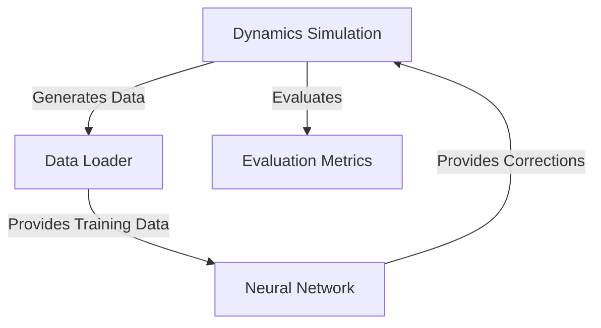
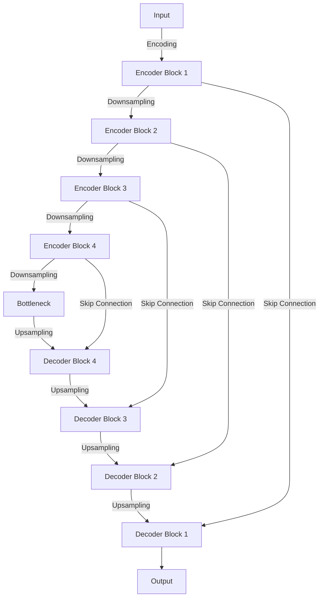

# System Patterns

## System Architecture

### Overall Architecture
The ML4Dynamics project follows a modular architecture with several key components:

```
ml4dynamics/
├── dynamics.py              # Core dynamics simulation classes
├── utils.py                 # Utility functions for data processing and visualization
├── types.py                 # Type definitions
├── models/                  # Machine learning models
│   ├── models_jax.py        # JAX-based neural network models
│   └── models_torch.py      # PyTorch-based neural network models
├── dataset_utils/           # Dataset processing utilities
├── trainers/                # Training utilities
├── exp/                     # Experiment scripts
└── visualization/           # Visualization utilities
```

### Key Components
1. **Dynamics Engine**: Abstract base class and concrete implementations for various dynamical systems
2. **Neural Network Models**: UNet and other architectures for learning from simulation data
3. **Training Pipeline**: Data loading, model training, and evaluation
4. **Simulation Pipeline**: Running simulations with or without ML augmentation
5. **Visualization Tools**: For analyzing and visualizing simulation results

## Design Patterns

### Object-Oriented Patterns
- **Abstract Base Classes**: The `dynamics` class serves as an abstract base class for all specific dynamics implementations (Navier-Stokes, reaction-diffusion, etc.)
- **Inheritance**: Specific dynamical systems inherit from the base `dynamics` class
- **Composition**: Models are composed of encoder and decoder components

### Functional Patterns
- **JAX Functional Style**: Heavy use of JAX's functional programming style for numerical computations
- **Pure Functions**: Many utility functions are designed as pure functions with no side effects
- **Higher-Order Functions**: Functions that take other functions as arguments (e.g., for different integration schemes)

### ML-Specific Patterns
- **Encoder-Decoder Architecture**: UNet uses encoder-decoder pattern with skip connections
- **Module Composition**: Complex models built from smaller, reusable modules
- **Training State Management**: Using Flax's `TrainState` for managing model parameters and optimization state

## Component Relationships

### Dynamics and Models Interaction


### UNet Architecture


## Key Technical Decisions

### Numerical Schemes
- **Crank-Nicolson Method**: Semi-implicit method for time integration of PDEs
- **Spectral Methods**: Used for spatial discretization in some PDEs
- **Finite Difference Methods**: Used for spatial discretization

### JAX as Primary ML Framework
- Advantages:
  - JIT compilation for performance
  - Automatic differentiation
  - GPU/TPU acceleration
  - Functional programming style

### Configurable Model Architectures
- Models accept parameters like kernel size to allow experimentation
- Consistent interfaces across different model architectures 